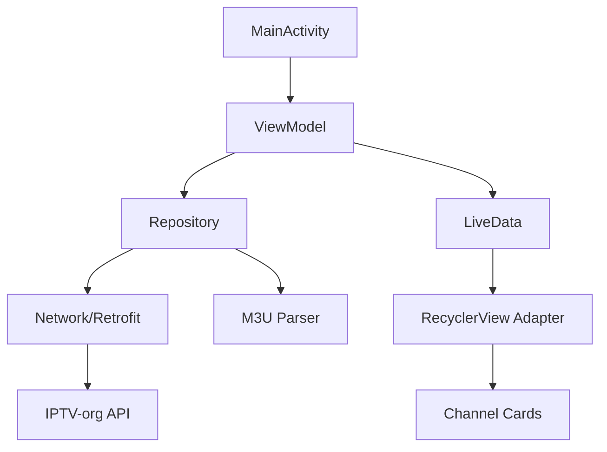

<div align="center">

# 🏆 GoldStream IPTV


### ✨ *The Most Luxurious IPTV Player for Android* ✨

**Stream 7000+ Live TV Channels with Premium Gold-Themed Interface**

<br/>


<br/>

[📥 Download](#-download) • [✨ Features](#-features) • [📸 Screenshots](#-screenshots) • [🚀 Installation](#-installation) • [🤝 Contributing](#-contributing)

<br/>

---

</div>

<br/>

## 🎯 Why GoldStream?

<table>
<tr>
<td width="33%" align="center">

<h3>Premium Design</h3>
<p>Luxury gold-themed UI that stands out from the crowd</p>
</td>
<td width="33%" align="center">

<h3>7000+ Channels</h3>
<p>Access thousands of live TV channels worldwide</p>
</td>
<td width="33%" align="center">

<h3>Lightning Fast</h3>
<p>Smooth playback with ExoPlayer technology</p>
</td>
</tr>
</table>

<br/>

## ✨ Features

<details open>
<summary><b>🎨 Premium UI/UX</b></summary>
<br/>

- 🏆 **Luxury Gold Theme** - Elegant dark interface with stunning gold accents
- 🎭 **Material Design 3** - Modern, responsive, and beautiful
- 📱 **Grid Layout** - Gorgeous 2-column channel display
- 🔍 **Smart Search** - Find any channel instantly
- 🎯 **Smart Filters** - Category & country filters with dropdown subcategories
- ⚡ **Smooth Animations** - Buttery smooth transitions

</details>

<details open>
<summary><b>📺 Core Functionality</b></summary>
<br/>

- 🌍 **7000+ Live Channels** - From [IPTV-org](https://github.com/iptv-org/iptv)
- 🎬 **ExoPlayer Integration** - Professional-grade video playback
- ⭐ **Favorites System** - Save your favorite channels
- 📂 **Category Grouping** - Animation, Movies, Sports, News & more
- 🌎 **Country Filters** - Browse by country
- 🖼️ **Channel Logos** - High-quality branding with smart caching

</details>

<details open>
<summary><b>🔧 Technical Excellence</b></summary>
<br/>

- 🏗️ **MVVM Architecture** - Clean, maintainable code
- 🔄 **LiveData & ViewModel** - Reactive UI updates
- 🌐 **Retrofit** - Efficient networking
- 📝 **Custom M3U Parser** - Parse any IPTV playlist
- 💾 **Glide Caching** - Lightning-fast image loading
- 🎯 **Optimized Performance** - Handles thousands of channels smoothly

</details>

<br/>

## 📸 Screenshots

<div align="center">

<table>
<tr>
<td align="center">

<br/>
<b>🏠 Home Screen</b>
<br/>
<i>Luxury gold header with smart filters</i>
</td>
<td align="center">

<br/>
<b>📺 Channel Grid</b>
<br/>
<i>Beautiful 2-column layout</i>
</td>
<td align="center">

<br/>
<b>🎬 Video Player</b>
<br/>
<i>Fullscreen ExoPlayer</i>
</td>
</tr>
</table>

</div>

<br/>

## 🚀 Installation

### 📥 Download

<div align="center">

**[⬇️ Download Latest APK](https://github.com/yourusername/GoldStream-IPTV/releases/latest)**

<br/>

*Minimum Android 7.0 (API 24) Required*

</div>

### 🛠️ Build from Source

```bash
# Clone the repository
git clone https://github.com/yourusername/GoldStream-IPTV.git

# Navigate to project
cd GoldStream-IPTV

# Build debug APK
./gradlew assembleDebug

# Install on connected device
./gradlew installDebug
```

<br/>

## 🏗️ Architecture

<div align="center">



</div>

### 📦 Tech Stack

<table>
<tr>
<td><b>Language</b></td>
<td>Java</td>
</tr>
<tr>
<td><b>Architecture</b></td>
<td>MVVM (Model-View-ViewModel)</td>
</tr>
<tr>
<td><b>UI Framework</b></td>
<td>Material Design 3</td>
</tr>
<tr>
<td><b>Video Player</b></td>
<td>ExoPlayer 2.19.1</td>
</tr>
<tr>
<td><b>Networking</b></td>
<td>Retrofit 2.9.0 + OkHttp 4.12.0</td>
</tr>
<tr>
<td><b>Image Loading</b></td>
<td>Glide 4.16.0</td>
</tr>
<tr>
<td><b>Async Operations</b></td>
<td>LiveData & ViewModel</td>
</tr>
</table>

<br/>

## 🎨 Design System

<div align="center">

### Color Palette

<table>
<tr>
<td align="center" bgcolor="#FFD700" width="150">
<br/><br/>
<b style="color: #000;">Primary Gold</b><br/>
<code>#FFD700</code>
<br/><br/>
</td>
<td align="center" bgcolor="#0F0F0F" width="150">
<br/><br/>
<b style="color: #FFD700;">Background</b><br/>
<code>#0F0F0F</code>
<br/><br/>
</td>
<td align="center" bgcolor="#1C1C1C" width="150">
<br/><br/>
<b style="color: #FFD700;">Card BG</b><br/>
<code>#1C1C1C</code>
<br/><br/>
</td>
<td align="center" bgcolor="#2A2A2A" width="150">
<br/><br/>
<b style="color: #FFD700;">Accent</b><br/>
<code>#2A2A2A</code>
<br/><br/>
</td>
</tr>
</table>

</div>

<br/>

## 🔮 Roadmap

<table>
<tr>
<td>

**Phase 1 - Core** ✅
- [x] Channel browsing
- [x] Search & filters
- [x] Video playback
- [x] Favorites

</td>
<td>

**Phase 2 - Enhanced** 🚧
- [ ] Picture-in-Picture
- [ ] Recently watched
- [ ] Custom playlists
- [ ] Sleep timer

</td>
<td>

**Phase 3 - Premium** 📋
- [ ] Chromecast support
- [ ] Parental controls
- [ ] EPG integration
- [ ] Multi-language

</td>
</tr>
</table>

<br/>

## 🤝 Contributing

We welcome contributions! Here's how you can help:

<div align="center">

**[📖 Read Contributing Guidelines](CONTRIBUTING.md)**

</div>

### Quick Start

1. 🍴 Fork the repository
2. 🌿 Create your feature branch (`git checkout -b feature/AmazingFeature`)
3. 💻 Make your changes
4. ✅ Test thoroughly
5. 📝 Commit (`git commit -m 'Add AmazingFeature'`)
6. 🚀 Push (`git push origin feature/AmazingFeature`)
7. 🎉 Open a Pull Request

<br/>

## 📊 Project Stats

<div align="center">


</div>

<br/>

## 📄 License

This project is licensed under a **Non-Commercial License** - see the [LICENSE](LICENSE) file for details.

**TL;DR:** ✅ Use freely • ✅ Modify • ✅ Share • ❌ No commercial use

<br/>

## 🙏 Acknowledgments

<table>
<tr>
<td align="center">
<a href="https://github.com/iptv-org/iptv">

<br/>
<b>IPTV-org</b>
</a>
<br/>
<i>Channel collection</i>
</td>
<td align="center">
<a href="https://github.com/google/ExoPlayer">

<br/>
<b>ExoPlayer</b>
</a>
<br/>
<i>Video playback</i>
</td>
<td align="center">
<a href="https://material.io/">

<br/>
<b>Material Design</b>
</a>
<br/>
<i>Design system</i>
</td>
</tr>
</table>

<br/>

## ⚠️ Disclaimer

<div align="center">

**Educational Purpose Only**

This app is for educational and personal use only. All channels are sourced from [IPTV-org](https://github.com/iptv-org/iptv), a community-driven collection of publicly available IPTV channels. The app does not host or provide any content itself.

**No Commercial Use** - This software may not be used for commercial purposes.

</div>

<br/>

---

<div align="center">

### 💖 Made with Love and ☕ Coffee

<br/>

**If you find this project useful, please consider giving it a ⭐**

<br/>

[](https://star-history.com/#yourusername/GoldStream-IPTV&Date)

<br/>

**[⬆ Back to Top](#-goldstream-iptv)**

</div>
